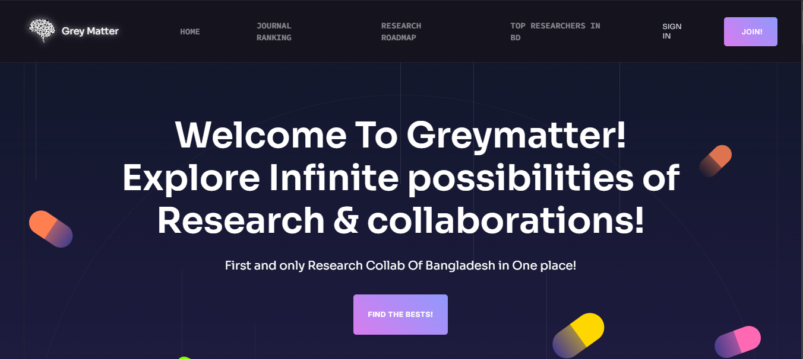
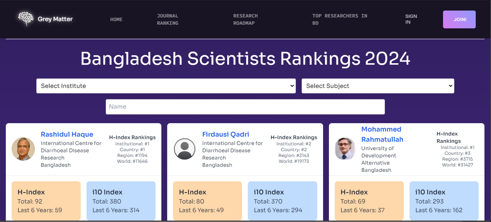
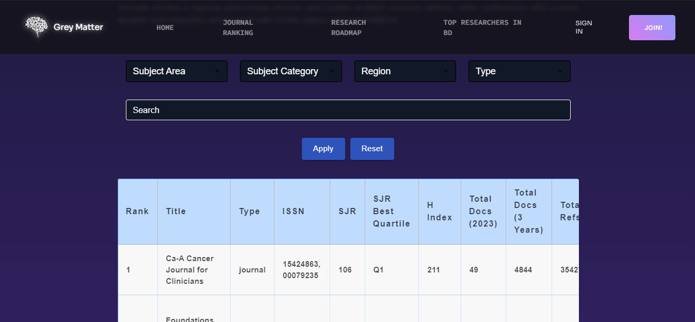

This repository contains the code corresponding to a collaborative project for Hackathon run by the HackCSB team in partnership with Coding Shikhbe Bangladesh, Bangladesh's fastest-growing AI-powered EdTech Platform <a href="https://hackcsb.devpost.com/?ref_content=default&ref_feature=challenge&ref_medium=portfolio" target="_blank"><b>[HackCSB]</b></a>. You can visit the corresponding website from this link <a href="https://grey-matter-omega.vercel.app/" target="_blank"><b>[Grey Matter]</b></a>.

## 📋 <a name="table">Table of Contents</a>

1. 🤖 [Introduction](#introduction)
2. 🎨 [Inspiration](#inspiration)
3. 💡 [What it does](#features)
4. 🛠️ [How we built it](#tech)
5. 🚧 [Challenges we ran into](#challenges)
6. 🏆 [Accomplishments we're proud of](#accomplishments)
7. 🎓 [What we learned](#learn)
8. 🤸 [Quick Start](#quick-start)
9. 🔮 [What's next](#next)
10. 🛠️ [Built With](#built-with)
11. 🚀 [Try it out](#try)
12. 🔗 [Data Sources](#data-sources)

## <a name="introduction">🤖 Introduction</a>

**Grey Matter** is a comprehensive platform designed to facilitate the discovery of top-tier researchers from Bangladesh and provide detailed insights into academic journals worldwide. Developed using **React JS** and **Tailwind CSS**, **Express JS** & **Vite**. This website serves as an essential tool for novice researchers, academic professionals, students, and researchers seeking to connect with influential figures in their fields or explore journals by various key metrics. Whether you're looking to collaborate with leading researchers or find journals that align with specific Sustainable Development Goals (SDGs), **Grey Matter** offers a streamlined, user-friendly experience.

## <a name="inspiration">🎨 Inspiration</a>

The idea behind **Grey Matter** was inspired by the need to bridge the gap between researchers in Bangladesh and the global academic community. We saw, upon stepping into the vast world of reserch, many of us become clueless. We have no visible guidelines about the Know-How's of research, no dedicated platform to learn about jounal & conferences and of course, no resource to learn about the biggest academic brains of Bangladesh in different sectors. They remain in the shadows. We say no to these and tried to bring the brains to the limelight. We aim to close that knowledge gap and that feeling of hopelessness. when  We recognized the challenges that students, academics, and professionals face when trying to find the right collaborators or access detailed journal information. Our aim was to create a platform that not only highlights the remarkable talent within Bangladesh but also provides a powerful tool for discovering academic resources worldwide.

## <a name="features">💡 What it does</a>

- **Researcher Database**: 
  - Access an extensive directory of top-class researchers exclusively from Bangladesh. The first dedicated platform built for the cause. 
  - Filter and search researchers based on various criteria including expertise, affiliation, and research impact.

- **Global Journal Search**: 
  - Explore a vast array of academic journals worldwide with detailed information.
  - Search by region, subject category, impact factor, and alignment with Sustainable Development Goals (SDGs).
    
- **Research Roadmaps and Guidelines**: 
  - Access comprehensive research roadmaps tailored to novice researchers.
  - A complete & detailed guideline of research know-Hows which stems from beginner friendly to intermediate level. Idea generation, websites, usual practises, ethical standards, Impact factor, choosing topic, writing the paper & publishing it.
  - Follow step-by-step guidelines to understand the research process, from literature review to publication.
  - Utilize tools and templates to organize research objectives, methodologies, and timelines.
  - Stay updated on ethical standards, citation practices, and data management requirements for a successful research journey.

- **User-Friendly Interface**: 
  - Intuitive and responsive design powered by React JS and Tailwind CSS.
  - Seamless navigation across different sections, ensuring a smooth user experience.

- **Advanced Search Filters**: 
  - Utilize comprehensive search filters to find the most relevant researchers and journals.
  - Refine your search results with ease, thanks to the platform's robust filtering options.

- **Real-Time Data Access**: 
  - Stay updated with the latest information on researchers and journals.
  - Real-time updates ensure that the platform always reflects the most current data.

- **Tailored for Academia**: 
  - Designed with the needs of academics, researchers, and students in mind.
  - A valuable resource for research collaboration, journal submission, and academic networking.

## <a name="tech">🛠️ How we built it</a>

- Utilized **React JS** for developing the dynamic and interactive frontend.
- Employed **Tailwind CSS** to create a responsive and visually appealing design.
- Utilised **Express JS** for efficient backend data connection.
- Initialized the project with **Vite** to ensure fast development and optimized build processes.
- Integrated data from **SCImago Journal Rank** and **AD Scientific Index** for comprehensive and reliable information.
- Implemented advanced search and filtering functionalities to handle large datasets efficiently.

## <a name="challenges">🚧 Challenges we ran into</a>

- Aggregating and normalizing data from multiple sources to maintain consistency and accuracy.
- Ensuring that the search and filtering mechanisms were both powerful and user-friendly.
- Balancing performance optimization with the need to manage large datasets without compromising on speed or user experience.
- Handling real-time data updates while ensuring the platform remained stable and responsive.
- Making it responsive for various devices.
- Implementing a complex yet smooth Front-End design for the website that has a lot of things going in the background.
- Maintaining the color code & standard throughout the website. 

## <a name="accomplishments">🏆 Accomplishments we're proud of</a>

- Successfully built a platform that highlights the research talent within Bangladesh and serves the global academic community.  
  
  <div align="center"><em>Snippets of Home Screen</em></div>
- Integrated a comprehensive, beginner-to-intermediate research guideline, covering everything from idea generation and topic selection to ethical standards, impact factors, and publishing.
- Developed a seamless and intuitive user interface that enhances user experience.  
- Integrated real-time data access to ensure users have the most current information.  
  
  <div align="center"><em>Snippets of Researchers Profile Screen</em></div>
- Managed to normalize and aggregate data from various sources effectively, maintaining high data integrity.  
  
  <div align="center"><em>Snippets of Journal Ranking Screen</em></div>


## <a name="learn">🎓 What we learned</a>

- The complexities involved in data integration and ensuring data consistency across multiple sources.
- The hardships of creating a complex yet smooth functioning design integration.
- Techniques for optimizing the performance of web applications, particularly when dealing with large datasets from different sources.
- The importance of user-centric design in creating a platform that is both functional and easy to navigate.
- Techniques of making a website responsive to different devices maintaining the previous design standards.
- Effective collaboration and task management within a multidisciplinary team to achieve project goals.

## <a name="quick-start">🤸 Quick Start</a>

**Prerequisites**

Make sure you have the following installed on your machine:

- [Git](https://git-scm.com/)
- [Node.js](https://nodejs.org/en)
- [npm](https://www.npmjs.com/) (Node Package Manager)

**Cloning the Repository**

```bash
git clone https://github.com/pr0ximaCent/Grey-Matter.git
cd Grey-Matter
```

**Installation**

Install the project dependencies using npm:

```bash
npm install
```

**Running the Project**

```bash
npm run dev
```

Open [http://localhost:5173](http://localhost:5173) in your browser to preview the project.

## <a name="next">🔮 What's next</a>

Moving forward, we plan to expand **Grey Matter** by including more features, such as personalized researcher recommendations, integration with academic networking platforms, and real-time collaboration tools. We also aim to broaden our data sources to include more countries and disciplines, making the platform even more comprehensive.

## <a name="team-members">👥 Team Members</a>

- **[Sabik Aftahee](https://github.com/pr0ximaCent)**
- **[Abu Md. Masbah Uddin](https://github.com/ma5bah)**
- **[Md. Refaj Hossan](https://github.com/RJ-Hossan)**
- **[Tofayel Ahmmed Babu](https://github.com/5pace4)**

## <a name="built-with">🛠️ Built With</a>

- **React.js**: For building the interactive user interface.
- **Tailwind CSS**: For responsive and custom-styled components.
- **Express JS**: For backend data streamlining & maintaining server requests, routing.
- **Vite**: For fast development and optimized build processes.
- **SCImago Journal Rank**: For comprehensive journal data.
- **AD Scientific Index**: For detailed researcher profiles.

## <a name="try">🚀 Try it out</a>

Check out **Grey Matter** in action: [Live Demo](https://grey-matter-omega.vercel.app/)


## <a name="data-sources">🔗 Data Sources</a>

**Grey Matter** relies on data aggregated from various reputable sources to provide accurate and up-to-date information on researchers and academic journals. We would like to acknowledge and thank the following platforms for their valuable data:

- **[AD Scientific Index](https://www.adscientificindex.com/?country_code=bd)**: Provided data on researcher profiles from Bangladesh, including their expertise, affiliations, and publication history.
- **[SCImago Journal Rank](https://www.scimagojr.com/journalrank.php)**: Supplied comprehensive information on academic journals, including impact factors, subject categories, and regional classifications.
  
We deeply appreciate the contributions of these platforms, which play a crucial role in making **Grey Matter** a reliable resource for the academic community.
